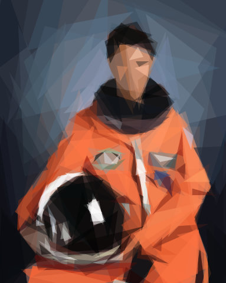
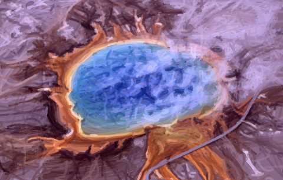
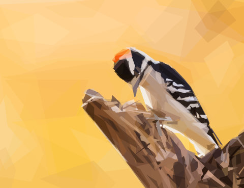
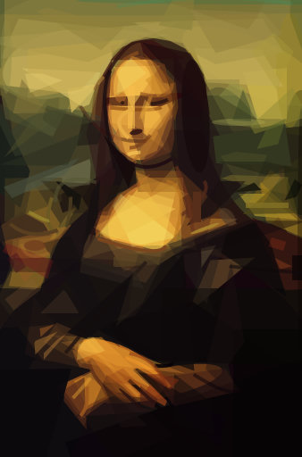
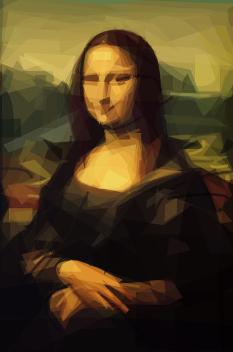
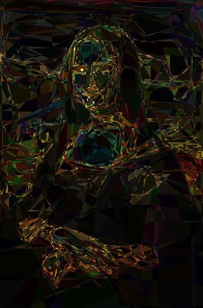

# primeval

[](https://github.com/domoarigatomrburato/primeval/actions/workflows/quality.yml)
[](LICENSE)

`primeval` is a Rust-powered image approximation tool that turns photos and artwork into **stylized reconstructions built from simple geometric shapes**.

Give it an input image and it searches for a layered approximation you can export as **clean SVG or PNG** output.

**[Try it in your browser](https://domoarigatomrburato.github.io/primeval/)**: the demo runs the engine as WebAssembly, on every core, and your image never leaves the page.

<!-- markdownlint-disable MD033 -->

<table>
  <tr>
    <td align="center"></td>
    <td align="center"></td>
    <td align="center"></td>
    <td align="center"></td>
  </tr>
  <tr>
    <td align="center"><sub>Mona Lisa · mixed · 200 steps</sub></td>
    <td align="center"><sub>Mae Jemison · triangle · 200 steps</sub></td>
    <td align="center"><sub>Grand Prismatic Spring · quadratic · 1000 steps</sub></td>
    <td align="center"><sub>Downy Woodpecker · polygon · 200 steps</sub></td>
  </tr>
</table>

Inspired by Michael Fogleman's original [`primitive`](https://github.com/fogleman/primitive), this repository is an **independent Rust implementation** with a reusable core library (`primeval-core`) and an ESM-only Node package (`@aleburato/primeval`) that includes both a programmatic API and a Node CLI, and runs the same API in the browser.

## Progression Gallery

Browse the full example gallery in [`docs/gallery.md`](docs/gallery.md). The sample images are in the public domain; [`docs/readme/originals/SOURCES.md`](docs/readme/originals/SOURCES.md) credits their sources.

## Highlights

- Fast multi-threaded search: hill climbing adds one shape per step, refit passes during the search revise the shapes so far against each other (for triangles, a joint gradient optimisation of every shape at once, kept when the working canvas gets closer to the input), then a final stage revises every shape (for triangles, polygons, rectangles, rotated rectangles, ellipses and circles, and every shape of `any` but its quadratics, a joint gradient optimisation of every shape at once, on a model of the anti-aliased output); seeded output does not depend on the number of CPU cores
- Nine shape modes in the CLI: mixed (`any`), triangle, rectangle, ellipse, circle, rotated rectangle, quadratic curve, rotated ellipse, and polygon. Every shape reads as its kind: triangles keep every angle above 15°, polygons are convex quadrilaterals with every angle above 15°, and a rectangle's long side, rotated or not, is at most 8 times its short side
- Optimization at a small working resolution, with the same shapes exported at a high output resolution
- Vector export via SVG, plus raster output as PNG
- The same API in the browser, through WebAssembly, multi-threaded on cross-origin isolated pages

## Install

### Node package

```bash
npm install @aleburato/primeval
```

Prebuilt native addons are provided for macOS (arm64, x64), Linux GNU libc (arm64, x64; glibc 2.17 or newer), and Windows (x64). Node 22.12+ is required.

> Install notes
>
> - Linux musl/Alpine is not supported yet; use a glibc-based distribution or container image.
> - Do not install with `--omit=optional` or equivalent package-manager settings; the native addon is delivered through platform-specific optional dependencies.
> - Accepted input formats are JPEG, PNG, and WebP only.

The package also exposes a CLI binary named `primeval`.

## Quick Start

Accepted input formats: **JPEG, PNG, and WebP**. Output can be SVG or PNG.

Run the package CLI (no Rust build required):

```bash
npx @aleburato/primeval photo.jpg --count 100
```

This writes `photo.svg` next to the input file. Use `--output` to choose a different path; the output format comes from its extension (`.svg` or `.png`):

```bash
npx @aleburato/primeval photo.jpg --output output/result.svg --count 100
```

Or install globally to call `primeval` directly:

```bash
npm install -g @aleburato/primeval
primeval photo.jpg --count 100
```

Replace `photo.jpg` with the path to your own JPEG, PNG, or WebP image.

Useful options:

- `--shape any|triangle|rectangle|ellipse|circle|rotated-rectangle|quadratic|rotated-ellipse|polygon` with `any` as the default
- `--count <N>` number of optimization steps (default `100`); higher values improve quality at the cost of time
- `--alpha auto|<N>` shape opacity: `auto` lets the optimizer choose, or a fixed integer `1`..`255` (default `auto`)
- `--resize-input <N>` resolution used during optimization; smaller is faster but less detailed (default `256`)
- `--output-size <N>` resolution of the final exported image (default `1024`)

These two options are independent: you can optimize at low resolution for speed and still export at high resolution:

```bash
# Fast optimization at 128px, high-res 2048px PNG output
primeval photo.jpg --output result.png --count 300 --resize-input 128 --output-size 2048
```

- `--seed <N>` for reproducible output: the same seed gives the same image with the same primeval version on the same platform
- `--force` to overwrite an existing output file
- `--quiet` to silence progress and notices on stderr

Write SVG output to stdout with `--output -`, or read the input from stdin with `-`:

```bash
primeval photo.jpg --output - --count 200 > out.svg
cat photo.jpg | primeval - --count 200 > out.svg
```

See the full CLI help with:

```bash
primeval --help
```

## Troubleshooting

- `Unsupported Linux runtime: linux-<arch>-musl`: published Linux binaries currently target GNU libc only. Alpine and other musl-based environments are not supported yet.
- `Failed to load native binding ...`: reinstall without omitting optional dependencies, make sure you are on Node 22.12+, and verify that your OS/CPU pair is one of the published targets listed above.
- `invalid image data ...`: `primeval` accepts JPEG, PNG, and WebP inputs only. Convert HEIC, TIFF, GIF, or other formats before rendering.
- `input file not found`, `input is a directory`, `permission denied reading input`, `input is not a regular file`: the CLI reads the input path itself and accepts regular files only (not directories, FIFOs, or devices). The Node API takes bytes, so read the file yourself, for example with `readFile` from `node:fs/promises`.

## Node Package

The npm package is **ESM-only** and targets **Node 22.12+**.

The examples below read `photo.jpg` from the current directory; replace it with the path to your own JPEG, PNG, or WebP image.

```js
import { approximate } from "@aleburato/primeval";
import { readFile } from "node:fs/promises";

const input = await readFile("photo.jpg");

const result = await approximate({
  input,
  output: "svg",
  render: {
    count: 300,
    shape: "any",
  },
});

console.log(result.format, result.width, result.height);
console.log(result.data.slice(0, 32));
```

`approximate()` accepts:

- `input` (required): the encoded image bytes as a `Uint8Array` (a `Buffer` is one). Read files yourself, for example with `readFile` from `node:fs/promises`.
- `output` (required): `"svg" | "png"`
- `render` (optional): render options forwarded to Rust; omitted (or `undefined`) fields use Rust defaults, and `null` is rejected like any other wrong type
- `execution` (optional): progress and cancellation controls

Render options:

- `count?: number` optimization steps, an integer `1..100000`. Higher values improve quality. Default: `100`.
- `shape?: "any" | "triangle" | "rectangle" | "ellipse" | "circle" | "rotated-rectangle" | "quadratic" | "rotated-ellipse" | "polygon"`. Default: `"any"`.
- `alpha?: "auto" | number` shape opacity. Use `"auto"` to let the optimizer choose each shape's opacity, or a fixed integer `1..255`. Any other value, including `0`, rejects with a `ValidationError`. Default: `"auto"`.
- `seed?: number | bigint` deterministic RNG seed, an integer `0..2^64 - 1`. A `number` seed must be a safe integer (at most `Number.MAX_SAFE_INTEGER`); pass larger seeds as a `bigint`. Omit it to let Rust choose a non-deterministic seed. The same seed and options give the same output with the same primeval version on the same platform, whatever the number of CPU cores; results can differ across platforms because floating-point math libraries differ.
- `background?: "auto" | string` opaque background color. Use `"auto"` (the alpha-weighted mean color of the input, or white for a fully transparent input) or a hex color in `RGB` or `RRGGBB` form, with optional leading `#`. Transparent inputs are flattened onto the background before rendering, so the output is always opaque. Default: `"auto"`.
- `resizeInput?: number` resolution used during optimization, an integer `2..2048`. Smaller values run faster but capture less detail. Default: `256`.
- `outputSize?: number` resolution of the final exported image, an integer `2..8192`. Default: `1024`.

Numeric options are checked in Rust: a fraction, `NaN`, or a value outside its range rejects with a `ValidationError`; nothing is wrapped or truncated.

These two options are independent — optimize at low resolution for speed, export at full resolution:

```js
const result = await approximate({
  input: await readFile("photo.jpg"),
  output: "png",
  render: {
    count: 300,
    resizeInput: 128,  // fast optimization pass
    outputSize: 2048,  // high-res final export
  },
});
```

Execution options:

- `onProgress?: (info) => void` receives `{ step, total, score, shape }` after each step, where `total` equals the `count` option and `score` is the current fit: the RMSE between the working canvas and the resized input over the RGB channels, divided by 255, from `0` (exact) to `1` (lower is better). `shape` is the SVG element of the shape the step added, formatted exactly as a shape line of the SVG output, for either `output` format; wrapping the shapes received so far in an `<svg>` with the final document's `viewBox` and background (from a `count: 1` render with the same options, say) draws a live preview. The render revises shapes it has already reported: after some steps, a refit pass that re-optimises one shape at a time can move, resize and recolour any shape so far (`score` includes the passes before the step). For triangles that pass is instead the joint gradient optimisation of every shape at once, kept only when the working canvas gets closer to the resized input, so coordinates already reported can become multiples of a quarter of a `viewBox` unit before the final stage. After the last step a final stage, without progress events, can revise every shape, so the result's shapes can differ from the preview and its score can be lower. For triangles, polygons, rectangles, rotated rectangles, ellipses and circles the final stage is a joint gradient optimisation of every shape at once, and the result's coordinates are multiples of a quarter of a `viewBox` unit, half a unit for rectangles, as are an ellipse's or a circle's centre and radii, while a rotated rectangle's corners are computed from such values, so they can be fractional; for `any` it is one refit pass, then the same optimisation of every shape but the quadratics, which keep their geometry, a rotated ellipse's rotation and the radius along it being computed from its optimised axis vector, so not on that grid. The optimisation's result is kept only if the PNG output at the working size is closer to the resized input than with the shapes before it; otherwise the stage keeps those, with coordinates not rounded to that grid. For quadratics the final stage is refit passes until one improves the fit by less than 1%, at most four; for rotated ellipses it is one refit pass. The passes and the stage keep the shapes' number, order and kind (an ellipse can turn into a `<circle>` or back), and the result replaces the preview when it arrives. If it throws, the render is cancelled, `onProgress` is not called again, and `approximate()` rejects with the value it threw, unchanged.
- `signal?: AbortSignal` cancels the render and rejects with `AbortError`, whose `cause` is `signal.reason`. An already-aborted signal rejects without starting any work. Once the signal fires before `approximate()` settles, the result is an `AbortError` even if the render had already finished.

`approximate()` is typed per output: a request with `output: "svg"` returns `Promise<SvgResult>` (`data: string`), one with `output: "png"` returns `Promise<PngResult>` (`data: Buffer`), and an `output` typed as `OutputFormat` returns `Promise<ApproximateResult>`, narrowed by `result.format`.

Convert results to a data URI:

```js
import { approximate, toDataUri } from "@aleburato/primeval";
import { readFile } from "node:fs/promises";

const input = await readFile("photo.jpg");
const result = await approximate({
  input,
  output: "png",
  render: { count: 200 },
});

const uri = toDataUri(result);
console.log(uri.slice(0, 64));
```

Handle errors by catching typed error classes. `approximate()` never throws synchronously: every failure, including an invalid request and a native addon that fails to load, is a rejected promise. Every error it rejects with extends `PrimevalError`, except the value a throwing `onProgress` threw. A `PrimevalError` has a stable `code` and, for errors from the native layer, a `cause` set to the native error:

| Class | `code` | When |
| --- | --- | --- |
| `ValidationError` | `INVALID_OPTION` | an option or request field is invalid |
| `ValidationError` | `INVALID_IMAGE` | the input is not a decodable JPEG, PNG, or WebP image, is larger than 16384 pixels on a side, needs more than 512 MiB to decode, or is smaller than 2 x 2 pixels |
| `AbortError` | `ABORTED` | `execution.signal` cancelled the render |
| `InternalError` | `INTERNAL` | a failure valid input should not cause, such as a native addon that fails to load, an encoder error, or a caught native panic |

Branch on `instanceof` or `code`, not on the message text. When an `INVALID_OPTION` error is about `output` or a `render` option, `error.option` names it (for example `"resizeInput"`) and `error.requirement` says what it accepts (for example `"must be an integer from 2 to 2048"`); the message is `` `${option} ${requirement}` ``.

```js
import { approximate, ValidationError } from "@aleburato/primeval";
import { readFile } from "node:fs/promises";

try {
  const result = await approximate({
    input: await readFile("photo.jpg"),
    output: "png",
  });
} catch (error) {
  if (error instanceof ValidationError) {
    console.error(`bad input or options (${error.code}):`, error.message);
  } else {
    throw error;
  }
}
```

Abort long renders with `AbortSignal`:

```js
import { AbortError, approximate } from "@aleburato/primeval";
import { readFile } from "node:fs/promises";

const controller = new AbortController();
const input = await readFile("photo.jpg");

try {
  const promise = approximate({
    input,
    output: "svg",
    render: { count: 1000 },
    execution: {
      signal: controller.signal,
      onProgress(info) {
        if (info.step === 10) {
          controller.abort();
        }
      },
    },
  });

  await promise;
} catch (error) {
  if (error instanceof AbortError) {
    console.log("render aborted");
  } else {
    throw error;
  }
}
```

Package notes:

- Accepted input formats: **JPEG, PNG, and WebP**, at least 2 x 2 and at most 16384 x 16384 pixels; decoding may allocate at most 512 MiB.
- Missing `render` fields are forwarded to Rust and resolved there; the package does not reinvent render defaults in TypeScript.
- Current Rust defaults are `count: 100`, `shape: "any"`, `alpha: "auto"`, omitted `seed`, `background: "auto"`, `resizeInput: 256`, and `outputSize: 1024`.
- `approximate()` returns exactly one output format per call: `svg` or `png`.
- The default shape is `any` (mixed); all nine CLI shape modes are available.
- Errors are `ValidationError`, `AbortError`, or `InternalError`, all subclasses of `PrimevalError`; see the table above.
- For SVG results, `data` is a `string`; for raster results, `data` is a `Buffer`.
- SVG output keeps the shapes at working resolution inside a `viewBox` and sets `width` and `height` to the output size, so it scales cleanly to any size. PNG output is an anti-aliased, opaque RGB image at the output size, with the same geometry as the SVG.

## Browser

The [demo](https://domoarigatomrburato.github.io/primeval/) is this package's browser build on a static page ([`demo/`](demo/)).

The same package runs in the browser through WebAssembly, with the same `approximate()` and `toDataUri()`, the same options, defaults, error classes and codes, `onProgress`, and `AbortSignal`. Import it from `@aleburato/primeval` as on Node: the browser entry is the `browser` condition of the package's `exports`, which bundlers use when they build for the browser. The package's tests run it unbundled and in a Vite 8 build, which needs no Vite config: Vite bundles the workers and emits both `.wasm` files as assets, and the page still downloads only one. Other bundlers are not tested. Without a bundler, serve the package's files from the page's own origin (browsers start module workers only from the same origin) and map the name to `dist/browser.js` with an import map:

```html
<script type="importmap">
  { "imports": { "@aleburato/primeval": "/node_modules/@aleburato/primeval/dist/browser.js" } }
</script>
<input type="file" accept="image/jpeg,image/png,image/webp" />
<script type="module">
  import { approximate } from "@aleburato/primeval";

  document.querySelector("input").addEventListener("change", async (event) => {
    const input = new Uint8Array(await event.target.files[0].arrayBuffer());
    const result = await approximate({ input, output: "svg", render: { count: 200 } });
    document.body.insertAdjacentHTML("beforeend", result.data);
  });
</script>
```

Browser notes:

- `input` is a `Uint8Array`, for example `new Uint8Array(await file.arrayBuffer())`. For PNG results, `data` is a `Uint8Array`, not a `Buffer`; SVG results are a `string`, as on Node.
- Threads: when the page is cross-origin isolated (`crossOriginIsolated` is `true`), the render uses a thread per logical core (`navigator.hardwareConcurrency`); otherwise it runs on one thread. Isolation needs both headers on the page, with `credentialless` instead of `require-corp` also accepted:

  ```text
  Cross-Origin-Opener-Policy: same-origin
  Cross-Origin-Embedder-Policy: require-corp
  ```

- Each call runs in a Web Worker of its own, which ends when the call settles, so concurrent calls do not share memory and the page's main thread stays free. An `AbortSignal` terminates the worker at once.
- A page downloads one of two WebAssembly builds, threaded or single-threaded, chosen before the download and compiled once per page: about 330 KB with brotli (about 440 KB with gzip), plus a few KB of JavaScript.
- The same seed and options give the same output. Native and browser output currently match for the same seed, but this is not guaranteed across platforms.

## Alpha Comparison (Mona Lisa, 200 steps, mixed shape)

The images below use identical settings (`shape: any`, `count: 200`, `seed: 42`) with only alpha changed:

- `alpha: "auto"`
- `alpha: 128` (fixed, historical default)

The difference image is the per-pixel difference of the two renders with each channel multiplied by four.

| Alpha auto | Alpha 128 (fixed) | Difference (boosted) |
| --- | --- | --- |
|  |  |  |

## CLI Reference

```text
primeval <input> [options]
```

`primeval` accepts:

- `input` (required positional): path to a JPEG, PNG, or WebP image, or `-` to read the image from stdin. Only regular files are read (not directories, FIFOs, or devices).
- `-o, --output <PATH>`: output file path. The format comes from the extension only: `.svg` writes SVG and `.png` writes PNG (case-insensitive); any other extension, or none, is an error. Use `-` to write SVG to stdout (PNG cannot be written to stdout). Defaults to `<input-stem>.svg` next to the input file, or to stdout when the input is `-`.
- `-f, --force`: overwrite an existing output file.
- `-q, --quiet`: print no progress and no notices on stderr.
- `--count <N>` optimization steps, `1..100000`. Higher values improve quality. Default: `100`.
- `--shape any|triangle|rectangle|ellipse|circle|rotated-rectangle|quadratic|rotated-ellipse|polygon`. Default: `any`.
- `--alpha auto|<N>` shape opacity. Use `auto` to let the optimizer choose each shape's opacity, or a fixed integer `1..255`. Default: `auto`.
- `--background <VALUE>` opaque background color. Use `auto` (the alpha-weighted mean color of the input, or white for a fully transparent input) or a hex color in `RGB` or `RRGGBB` form, with optional leading `#`. Transparent inputs are flattened onto the background, so the output is always opaque. Default: `auto`.
- `--resize-input <N>` resolution used during optimization, `2..2048`. Smaller values run faster but capture less detail; the final output is always rendered at `--output-size` resolution. Default: `256`.
- `--output-size <N>` resolution of the final exported image, `2..8192`. Default: `1024`.
- `--seed <N>` deterministic RNG seed, `0..18446744073709551615`. If omitted, Rust selects a random seed. The same seed and options give the same output with the same primeval version on the same platform, whatever the number of CPU cores; results can differ across platforms.
- `-v, --version` print the package version and exit.
- `-h, --help` print usage to stdout and exit.

CLI notes:

- The CLI never overwrites an existing file, whether the path was derived or given with `--output`, unless you pass `--force`. It checks the output path before rendering, so an existing file or a directory fails immediately. Missing parent directories are created.
- When the output path is derived, the CLI prints `output: <path>` on stderr (unless `--quiet`).
- Progress is shown only when stderr is a terminal: a single line, updated in place, with the step, the total, the score, and the elapsed time.
- Ctrl-C cancels the render and exits without writing the output; a second Ctrl-C exits immediately.
- Errors go to stderr; stdout carries only the SVG for `--output -`, `--help`, and `--version`. Errors about an option name its flag, for example `--resize-input must be an integer from 2 to 2048`.
- Exit codes: `0` success, `1` runtime error (unreadable input, invalid image data or option values rejected by the renderer, existing output, write failure), `2` usage error (unknown option, missing or extra arguments, a numeric option that is not a non-negative integer, unknown shape, unsupported output extension, empty output path), `130` interrupted by Ctrl-C.

## Deploying

### Platforms

Prebuilt addons cover macOS (arm64, x64), Linux GNU libc (arm64, x64), and Windows (x64), on Node 22.12+. The Linux addons are built against glibc 2.17, so they run on any distribution with glibc 2.17 or newer; musl-based systems such as Alpine are not supported. Every addon targets the baseline instruction set of its architecture: the release checks that none needs AVX-512 on x86_64 or SVE on aarch64.

### Memory

A render's memory, phase by phase:

- **Decoding.** The input is decoded at full resolution, flattened onto the background, and resized to `resizeInput`, with temporary copies during conversion and resampling. This phase scales with the decoded image, not the file: a 4000 x 3000 photo decodes to about 36 MB of RGB. Inputs are limited to 16384 pixels per side and 512 MiB of decoder allocation. The full-resolution image is freed before the search starts.
- **Search.** About 38 bytes per working pixel (the target, the canvas, and per-row prefix sums): about 2.5 MB at the default `resizeInput: 256` and about 150 MiB at the maximum, `2048`. A refit pass, during the search or in the final stage, adds about 22 bytes per working pixel, plus checkpoints of the canvas: about √`count` copies of 3 bytes per working pixel, at most 64 MiB. For triangles, polygons, rectangles, rotated rectangles, ellipses, circles and `any` the final stage ends with the joint optimisation, which adds about 43 bytes per working pixel, plus checkpoints of its canvas, about √`count` copies of 12 bytes per working pixel and at most 64 MiB, and the canvas under each of about √`count` shapes within its bounds.
- **Output.** On top of the search buffers, PNG output needs 7 bytes per output pixel while it is rasterized: 7 MiB at the default `outputSize: 1024` and 448 MiB at the maximum, `8192`. SVG output is text that grows with `count`, not with `outputSize`.

The options are bounded: `count` ≤ 100000, `resizeInput` ≤ 2048, `outputSize` ≤ 8192. Budget memory per concurrent render.

### Concurrency

`approximate()` runs the render off the JavaScript thread, so the event loop stays free. Every render in a process shares one Rayon thread pool, one thread per available CPU by default (set `RAYON_NUM_THREADS` before the process starts to change it). Concurrent renders therefore share the cores rather than each getting all of them: bound the number in flight with a queue to bound latency and memory. `onProgress` reports each step, and an `AbortSignal` cancels a render; cancellation takes effect before the next step (in a refit pass, before the next shape; in the joint optimisation, before the next iteration), while decoding itself runs to completion.

### Batch throughput

For many images, such as placeholders generated at build time, throughput matters more than the latency of one image. A single render does not scale linearly with cores: each step does some work over the whole canvas on one thread and then waits for its slowest search task, so cores sit idle. Starting a few `approximate()` calls at once, instead of awaiting each in turn, lets them fill those gaps in the shared pool and finishes the batch sooner. `approximate()` has no per-render thread count; to give each render fewer threads, split the batch across processes and set `RAYON_NUM_THREADS` in each. With the CLI, for example, four processes of two threads each write `<name>.svg` next to every JPEG under `images/` (add `-f` to overwrite earlier output):

```bash
find images -name '*.jpg' -print0 | RAYON_NUM_THREADS=2 xargs -0 -P 4 -n 1 primeval -q
```

### Untrusted input

- The Node API takes bytes, never paths: read the file yourself and decide what may be read. The CLI reads the path you give it, and accepts regular files only.
- Only JPEG, PNG, and WebP are decoded, within the limits above; anything else rejects with `ValidationError` (`INVALID_IMAGE`).
- Options are checked before any work starts, and out-of-range values reject with `ValidationError` (`INVALID_OPTION`). The accepted ranges still allow very long renders (`count: 100000` at `resizeInput: 2048`), so cap them further for untrusted callers.
- Cap the file size before reading it; the decode limits bound the decoded image, not the upload.
- Set a timeout, since a render's time grows with `count` and `resizeInput`:

```js
const result = await approximate({
  input: await readFile("photo.jpg"),
  output: "svg",
  render: { count: 300 },
  execution: { signal: AbortSignal.timeout(10_000) },
});
```

## Benchmarks

Wall time per call and final score for 200 steps of each shape mode on the two paintings in `docs/readme/originals/`, *American Gothic* (`americangothic.jpg`) and *Mona Lisa* (`monalisa.jpg`), with default options (`resizeInput: 256`, `outputSize: 1024`, alpha and background `auto`), seed 42 and PNG output. The time covers decoding, the search and the PNG encode. The score is the normalised RMSE between the canvas and the input at working resolution (lower is better).

| Shape | American Gothic time | American Gothic score | Mona Lisa time | Mona Lisa score |
| --- | ---: | ---: | ---: | ---: |
| Mixed | 2.03 s | 0.0349 | 1.90 s | 0.0292 |
| Triangle | 0.92 s | 0.0360 | 0.80 s | 0.0296 |
| Rectangle | 0.77 s | 0.0460 | 0.64 s | 0.0384 |
| Ellipse | 1.01 s | 0.0448 | 0.85 s | 0.0372 |
| Circle | 1.04 s | 0.0545 | 0.83 s | 0.0414 |
| Rotated rectangle | 0.99 s | 0.0443 | 0.92 s | 0.0356 |
| Quadratic | 6.60 s | 0.0882 | 4.77 s | 0.0663 |
| Rotated ellipse | 2.99 s | 0.0359 | 2.69 s | 0.0302 |
| Polygon | 3.43 s | 0.0315 | 3.21 s | 0.0275 |

Measured at commit `0298d9c` on an Apple M2 Pro (10 cores: 6 performance, 4 efficiency) under macOS, from a single run of:

```bash
cargo run --release -p primeval-render --example quality -- --no-synthetic --steps 200
```

Times vary between runs and machines. Scores are deterministic for a given commit and platform, whatever the core count. [`CONTRIBUTING.md`](CONTRIBUTING.md#benchmarks) describes the runner and its other columns.

### Compared with Go primitive

The same two paintings, *American Gothic* and *Mona Lisa*, through the original Go [`primitive`](https://github.com/fogleman/primitive) and primeval, with the same settings: the shape kind, the step count, alpha 128 (Go's default), working size 256, output size 1024, the average colour as background, and PNG output. Speedup is Go's time over primeval's, summed over both images. RMSE is the RGB error (0–255, lower is better) of each PNG against the original resized to 1024 with Lanczos3, averaged over both images.

| Shape | 200 steps speedup | Go RMSE | primeval RMSE | 1000 steps speedup | Go RMSE | primeval RMSE |
| --- | ---: | ---: | ---: | ---: | ---: | ---: |
| Mixed | 2.9× | 14.86 | 12.11 | 3.6× | 12.61 | 9.70 |
| Triangle | 3.9× | 15.78 | 12.34 | 3.9× | 13.66 | 9.46 |
| Rectangle | 3.7× | 15.91 | 14.09 | 4.1× | 13.54 | 11.02 |
| Ellipse | 5.6× | 14.77 | 13.83 | 6.9× | 11.53 | 10.89 |
| Circle | 6.7× | 16.22 | 15.17 | 8.4× | 12.45 | 11.73 |
| Rotated rectangle | 3.3× | 15.44 | 12.97 | 3.7× | 12.84 | 10.06 |
| Quadratic | 1.2× | 45.37 | 25.53 | 1.5× | 26.43 | 11.18 |
| Rotated ellipse | 4.0× | 15.23 | 12.57 | 4.7× | 12.92 | 9.61 |
| Polygon | 1.8× | 14.69 | 11.60 | 1.8× | 12.93 | 9.30 |

In total, 200 steps took 100 s with Go and 36 s with primeval (2.8×), and 1000 steps 435 s and 134 s (3.2×). primeval's RMSE was lower in all 18 image and shape configurations at both step counts, by 19% (200 steps) and 26% (1000 steps) in geometric mean. The search runs refit passes along the way (for triangles, the joint optimisation of every shape instead) and ends with refit passes and, for triangles, polygons, rectangles and rotated rectangles, a joint optimisation of every shape, which is where the extra time against the previous engine goes. At 1000 steps the SVG is 11–31% smaller than Go's for six of the nine kinds, the same size for rectangles, 2% smaller for ellipses and 10% larger for triangles.

Go is timed as a process (decode, search, render, writing PNG and SVG); primeval is timed in-process (decode, search, PNG encode), and the Node CLI adds about 0.1 s of startup on top. Go seeds itself from the clock, so each Go figure is from 3 runs (median time, mean RMSE); primeval used seed 42, with the median of 3 runs as its time. Measured at commit `0298d9c` against `primitive` `v0.0.0-20200504002142-0373c216458b` (Go 1.27.1) on the same Apple M2 Pro, from:

```bash
cargo run --release -p primeval-render --example versus_go -- --steps 200,1000 --reps 3
```

## Used in Production

- [nudaluce.com](https://nudaluce.com) *(NSFW)* — my photography portfolio uses `primeval`-generated SVG placeholders as image previews. The site includes artistic male nude portraits.

## License

Released under the [MIT License](LICENSE).
