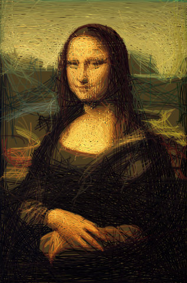
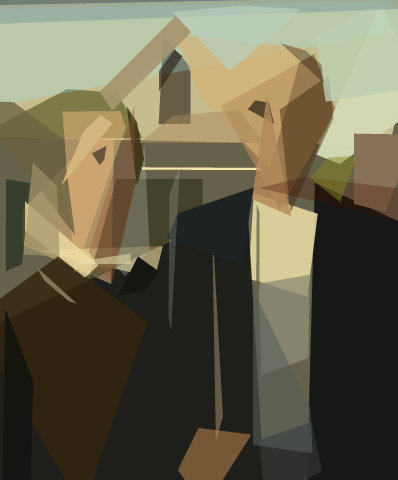

# primeval

`primeval` is a Rust-powered image approximation tool that turns photos and artwork into **stylized reconstructions built from simple geometric shapes**.

Give it an input image and it searches for a layered approximation you can export as **clean SVG or PNG** output.

<!-- markdownlint-disable MD033 -->

<table>
  <tr>
    <td align="center"></td>
    <td align="center"></td>
    <td align="center"></td>
    <td align="center"></td>
  </tr>
  <tr>
    <td align="center"><sub>Mona Lisa · mixed · 200 steps</sub></td>
    <td align="center"><sub>Mona Lisa · quadratic · 1000 steps</sub></td>
    <td align="center"><sub>American Gothic · polygon · 50 steps</sub></td>
    <td align="center"><sub>Fiume Po (M.Kenna) · circle · 200 steps</sub></td>
  </tr>
</table>

Inspired by Michael Fogleman's original [`primitive`](https://github.com/fogleman/primitive), this repository is an **independent Rust implementation** with a reusable core library (`primeval-core`) and an ESM-only Node package (`@aleburato/primeval`) that includes both a programmatic API and a Node CLI.

## Progression Gallery

Browse the full example gallery in [`docs/gallery.md`](docs/gallery.md).

## Highlights

- Fast hill-climbing search with multi-threaded worker contexts
- Nine shape modes in the CLI: mixed (`any`), triangle, rectangle, ellipse, circle, rotated rectangle, quadratic curve, rotated ellipse, and polygon
- Small working-resolution optimization with high-resolution output replay
- Vector export via SVG, plus raster output as PNG

## Install

### Node package

```bash
npm install @aleburato/primeval
```

Prebuilt native addons are provided for macOS (arm64, x64), Linux GNU libc (arm64, x64), and Windows (x64). Node 22.12+ is required.

> Install notes
>
> - Linux musl/Alpine is not supported yet; use a glibc-based distribution or container image.
> - Do not install with `--omit=optional` or equivalent package-manager settings; the native addon is delivered through platform-specific optional dependencies.
> - Accepted input formats are JPEG, PNG, and WebP only.

The package also exposes a CLI binary named `primeval`.

## Quick Start

Accepted input formats: **JPEG, PNG, and WebP**. Output can be SVG or PNG.

Run the package CLI (no Rust build required):

```bash
npx @aleburato/primeval photo.jpg --count 100
```

This writes `photo.svg` next to the input file. Use `--output` to choose a different path; the output format comes from its extension (`.svg` or `.png`):

```bash
npx @aleburato/primeval photo.jpg --output output/result.svg --count 100
```

Or install globally to call `primeval` directly:

```bash
npm install -g @aleburato/primeval
primeval photo.jpg --count 100
```

Replace `photo.jpg` with the path to your own JPEG, PNG, or WebP image.

Useful options:

- `--shape any|triangle|rectangle|ellipse|circle|rotated-rectangle|quadratic|rotated-ellipse|polygon` with `any` as the default
- `--count <N>` number of optimization steps (default `100`); higher values improve quality at the cost of time
- `--alpha auto|<N>` shape opacity: `auto` lets the optimizer choose, or a fixed integer `1`..`255` (default `auto`)
- `--resize-input <N>` resolution used during optimization; smaller is faster but less detailed (default `256`)
- `--output-size <N>` resolution of the final exported image (default `1024`)

These two options are independent: you can optimize at low resolution for speed and still export at high resolution:

```bash
# Fast optimization at 128px, high-res 2048px PNG output
primeval photo.jpg --output result.png --count 300 --resize-input 128 --output-size 2048
```

- `--seed <N>` for deterministic output
- `--force` to overwrite an existing output file
- `--quiet` to silence progress and notices on stderr

Write SVG output to stdout with `--output -`, or read the input from stdin with `-`:

```bash
primeval photo.jpg --output - --count 200 > out.svg
cat photo.jpg | primeval - --count 200 > out.svg
```

See the full CLI help with:

```bash
primeval --help
```

## Troubleshooting

- `Unsupported Linux runtime: linux-<arch>-musl`: published Linux binaries currently target GNU libc only. Alpine and other musl-based environments are not supported yet.
- `Failed to load native binding ...`: reinstall without omitting optional dependencies, make sure you are on Node 22.12+, and verify that your OS/CPU pair is one of the published targets listed above.
- `invalid image data ...`: `primeval` accepts JPEG, PNG, and WebP inputs only. Convert HEIC, TIFF, GIF, or other formats before rendering.
- `input file not found`, `input is a directory`, `permission denied reading input`, `input is not a regular file`: the CLI reads the input path itself and accepts regular files only (not directories, FIFOs, or devices). The Node API takes bytes, so read the file yourself, for example with `readFile` from `node:fs/promises`.

## Node Package

The npm package is **ESM-only** and targets **Node 22.12+**.

```js
import { approximate } from "@aleburato/primeval";
import { readFile } from "node:fs/promises";

const input = await readFile("docs/readme/originals/monalisa.jpg");

const result = await approximate({
  input,
  output: "svg",
  render: {
    count: 300,
    shape: "any",
  },
});

console.log(result.format, result.width, result.height);
console.log(result.data.slice(0, 32));
```

`approximate()` accepts:

- `input` (required): the encoded image bytes as a `Uint8Array` (a `Buffer` is one). Read files yourself, for example with `readFile` from `node:fs/promises`.
- `output` (required): `"svg" | "png"`
- `render` (optional): render options forwarded to Rust; omitted fields use Rust defaults
- `execution` (optional): progress and cancellation controls

Render options:

- `count?: number` optimization steps. Higher values improve quality. Default: `100`.
- `shape?: "any" | "triangle" | "rectangle" | "ellipse" | "circle" | "rotated-rectangle" | "quadratic" | "rotated-ellipse" | "polygon"`. Default: `"any"`.
- `alpha?: "auto" | number` shape opacity. Use `"auto"` to let the optimizer choose each shape's opacity, or a fixed integer `1..255`. Any other value, including `0`, throws a `ValidationError`. Default: `"auto"`.
- `seed?: number` deterministic RNG seed (non-negative integer). Omit it to let Rust choose a non-deterministic seed.
- `background?: "auto" | string` opaque background color. Use `"auto"` (the alpha-weighted mean color of the input, or white for a fully transparent input) or a hex color in `RGB` or `RRGGBB` form, with optional leading `#`. Transparent inputs are flattened onto the background before rendering, so the output is always opaque. Default: `"auto"`.
- `resizeInput?: number` resolution used during optimization. Smaller values run faster but capture less detail. Default: `256`.
- `outputSize?: number` resolution of the final exported image. Default: `1024`.

These two options are independent — optimize at low resolution for speed, export at full resolution:

```js
const result = await approximate({
  input: await readFile("photo.jpg"),
  output: "png",
  render: {
    count: 300,
    resizeInput: 128,  // fast optimization pass
    outputSize: 2048,  // high-res final export
  },
});
```

Execution options:

- `onProgress?: (info) => void` receives `{ step, total, score }` after each step, where `total` equals the `count` option and `score` is the current RMSE fit (lower is better).
- `signal?: AbortSignal` cancels an in-flight render and rejects with `AbortError`.

Convert results to a data URI:

```js
import { approximate, toDataUri } from "@aleburato/primeval";
import { readFile } from "node:fs/promises";

const input = await readFile("docs/readme/originals/monalisa.jpg");
const result = await approximate({
  input,
  output: "png",
  render: { count: 200 },
});

const uri = toDataUri(result);
console.log(uri.slice(0, 64));
```

Handle errors by catching typed error classes:

```js
import { approximate, ValidationError } from "@aleburato/primeval";
import { readFile } from "node:fs/promises";

try {
  const result = await approximate({
    input: await readFile("photo.jpg"),
    output: "png",
  });
} catch (error) {
  if (error instanceof ValidationError) {
    console.error("bad input or options:", error.message);
  } else {
    throw error;
  }
}
```

Abort long renders with `AbortSignal`:

```js
import { AbortError, approximate } from "@aleburato/primeval";
import { readFile } from "node:fs/promises";

const controller = new AbortController();
const input = await readFile("docs/readme/originals/monalisa.jpg");

try {
  const promise = approximate({
    input,
    output: "svg",
    render: { count: 1000 },
    execution: {
      signal: controller.signal,
      onProgress(info) {
        if (info.step === 10) {
          controller.abort();
        }
      },
    },
  });

  await promise;
} catch (error) {
  if (error instanceof AbortError) {
    console.log("render aborted");
  } else {
    throw error;
  }
}
```

Package notes:

- Accepted input formats: **JPEG, PNG, and WebP**.
- Missing `render` fields are forwarded to Rust and resolved there; the package does not reinvent render defaults in TypeScript.
- Current Rust defaults are `count: 100`, `shape: "any"`, `alpha: "auto"`, omitted `seed`, `background: "auto"`, `resizeInput: 256`, and `outputSize: 1024`.
- `approximate()` returns exactly one output format per call: `svg` or `png`.
- The default shape is `any` (mixed); all nine CLI shape modes are available.
- Errors are mapped to `ValidationError` and `AbortError` — use `instanceof` to distinguish them.
- For SVG results, `data` is a `string`; for raster results, `data` is a `Buffer`.
- SVG output keeps the shapes at working resolution inside a `viewBox` and sets `width` and `height` to the output size, so it scales cleanly to any size. PNG output is an anti-aliased, opaque RGB image at the output size, with the same geometry as the SVG.

## Alpha Comparison (Mona Lisa, 200 steps, mixed shape)

The images below use identical settings (`shape: any`, `count: 200`, `seed: 42`) with only alpha changed:

- `alpha: "auto"`
- `alpha: 128` (fixed, historical default)

| Alpha auto | Alpha 128 (fixed) | Difference (boosted) |
| --- | --- | --- |
|  |  |  |

## CLI Reference

```text
primeval <input> [options]
```

`primeval` accepts:

- `input` (required positional): path to a JPEG, PNG, or WebP image, or `-` to read the image from stdin. Only regular files are read (not directories, FIFOs, or devices).
- `-o, --output <PATH>`: output file path. The format comes from the extension only: `.svg` writes SVG and `.png` writes PNG (case-insensitive); any other extension, or none, is an error. Use `-` to write SVG to stdout (PNG cannot be written to stdout). Defaults to `<input-stem>.svg` next to the input file, or to stdout when the input is `-`.
- `-f, --force`: overwrite an existing output file.
- `-q, --quiet`: print no progress and no notices on stderr.
- `--count <N>` optimization steps. Higher values improve quality. Default: `100`.
- `--shape any|triangle|rectangle|ellipse|circle|rotated-rectangle|quadratic|rotated-ellipse|polygon`. Default: `any`.
- `--alpha auto|<N>` shape opacity. Use `auto` to let the optimizer choose each shape's opacity, or a fixed integer `1..255`. Default: `auto`.
- `--background <VALUE>` opaque background color. Use `auto` (the alpha-weighted mean color of the input, or white for a fully transparent input) or a hex color in `RGB` or `RRGGBB` form, with optional leading `#`. Transparent inputs are flattened onto the background, so the output is always opaque. Default: `auto`.
- `--resize-input <N>` resolution used during optimization. Smaller values run faster but capture less detail; the final output is always rendered at `--output-size` resolution. Default: `256`.
- `--output-size <N>` resolution of the final exported image. Default: `1024`.
- `--seed <N>` deterministic RNG seed (non-negative integer). If omitted, Rust selects a random seed.
- `-v, --version` print the package version and exit.
- `-h, --help` print usage to stdout and exit.

CLI notes:

- The CLI never overwrites an existing file, whether the path was derived or given with `--output`, unless you pass `--force`. It checks the output path before rendering, so an existing file or a directory fails immediately. Missing parent directories are created.
- When the output path is derived, the CLI prints `output: <path>` on stderr (unless `--quiet`).
- Progress is shown only when stderr is a terminal: a single line, updated in place, with the step, the total, the score, and the elapsed time.
- Ctrl-C cancels the render and exits without writing the output; a second Ctrl-C exits immediately.
- Errors go to stderr; stdout carries only the SVG for `--output -`, `--help`, and `--version`.
- Exit codes: `0` success, `1` runtime error (unreadable input, invalid image data or option values rejected by the renderer, existing output, write failure), `2` usage error (unknown option, missing or extra arguments, invalid numeric value or shape, unsupported output extension, empty output path), `130` interrupted by Ctrl-C.

## Benchmarks

Using `docs/readme/originals/americangothic.jpg` as the input image, `500` steps per run, and all nine shape modes (`any`, triangle, rectangle, ellipse, circle, rotated rectangle, quadratic, rotated ellipse, polygon), primeval completed the full matrix in **`1m 18s`** versus **`2m 41s`** for the original Go CLI from [`fogleman/primitive`](https://github.com/fogleman/primitive).

That works out to a **`2.06x` speedup overall** (`51.5%` less total time). On this run, Rust was **faster in all 9 modes** and delivered **`4.0%` lower average RMSE** overall (`15.97` vs `16.63`). It also produced lower RMSE in 7 of the 9 individual modes.

| Shape | Rust time | Go time | Speedup | Rust RMSE | Go RMSE |
| --- | ---: | ---: | ---: | ---: | ---: |
| Mixed | 7.6s | 14.6s | 1.9x | 12.3 | 13.6 |
| Triangle | 4.0s | 9.1s | 2.3x | 14.4 | 14.6 |
| Rectangle | 2.5s | 7.1s | 2.8x | 15.2 | 14.6 |
| Ellipse | 5.6s | 18.2s | 3.3x | 12.3 | 12.6 |
| Circle | 7.6s | 21.7s | 2.9x | 14.2 | 14.5 |
| Rotated rectangle | 4.5s | 9.6s | 2.1x | 12.8 | 14.1 |
| Quadratic | 6.1s | 23.2s | 3.8x | 39.5 | 38.3 |
| Rotated ellipse | 24.8s | 39.4s | 1.6x | 11.8 | 13.8 |
| Polygon | 15.2s | 17.7s | 1.2x | 11.1 | 13.7 |

*Lower RMSE is better.* Times are from a single run on an Apple M-series machine and will vary by hardware. The upstream Go CLI does not expose a seed flag, so RMSE figures reflect one representative run rather than a deterministic replay.

## Used in Production

- [nudaluce.com](https://nudaluce.com) *(NSFW)* — my photography portfolio uses `primeval`-generated SVG placeholders as image previews. The site includes artistic male nude portraits.

## License

Released under the [MIT License](LICENSE).
