# Progression Gallery

<!-- markdownlint-disable MD033 -->

Each table below shows one original image, with shape modes in rows and step counts in columns. Every preview is a JPEG thumbnail that links to the generated SVG; the size under it is the SVG's.

Generated by `cargo run --release -p primeval-render --example gallery` with default options, seed 42 and 50, 200, 1000 steps. Do not edit this file by hand; see `CONTRIBUTING.md`.

The originals are in the public domain: [Sources and credits](readme/originals/SOURCES.md).

### American Gothic

   
  Original · JPG 80.6 KB

<table>
  <tr>
    <th align="left">Shape mode</th>
    <th align="center">50 steps</th>
    <th align="center">200 steps</th>
    <th align="center">1000 steps</th>
  </tr>
  <tr>
    <td><strong>Mixed</strong></td>
    <td align="center">
      
       
      SVG 4.8 KB
    </td>
    <td align="center">
      
       
      SVG 19.6 KB
    </td>
    <td align="center">
      
       
      SVG 103.8 KB
    </td>
  </tr>
  <tr>
    <td><strong>Triangle</strong></td>
    <td align="center">
      
       
      SVG 4.2 KB
    </td>
    <td align="center">
      
       
      SVG 16.6 KB
    </td>
    <td align="center">
      
       
      SVG 84.3 KB
    </td>
  </tr>
  <tr>
    <td><strong>Rectangle</strong></td>
    <td align="center">
      <a href="images/progression/americangothic/rectangle-50.svg">
        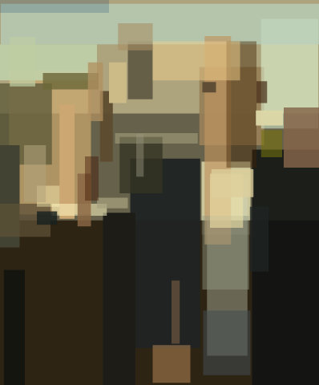
      </a>
       
      SVG 4.2 KB
    </td>
    <td align="center">
      
       
      SVG 16.4 KB
    </td>
    <td align="center">
      
       
      SVG 80.5 KB
    </td>
  </tr>
  <tr>
    <td><strong>Ellipse</strong></td>
    <td align="center">
      
       
      SVG 4.2 KB
    </td>
    <td align="center">
      <a href="images/progression/americangothic/ellipse-200.svg">
        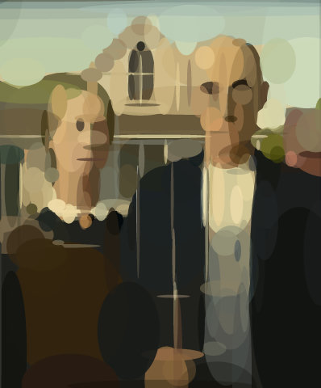
      </a>
       
      SVG 16.5 KB
    </td>
    <td align="center">
      
       
      SVG 81.5 KB
    </td>
  </tr>
  <tr>
    <td><strong>Circle</strong></td>
    <td align="center">
      
       
      SVG 3.5 KB
    </td>
    <td align="center">
      
       
      SVG 14.3 KB
    </td>
    <td align="center">
      
       
      SVG 70.7 KB
    </td>
  </tr>
  <tr>
    <td><strong>Rotated Rectangle</strong></td>
    <td align="center">
      
       
      SVG 5.4 KB
    </td>
    <td align="center">
      
       
      SVG 21.2 KB
    </td>
    <td align="center">
      
       
      SVG 107.6 KB
    </td>
  </tr>
  <tr>
    <td><strong>Quadratic</strong></td>
    <td align="center">
      <a href="images/progression/americangothic/quadratic-50.svg">
        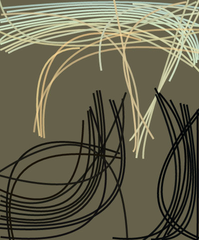
      </a>
       
      SVG 6.0 KB
    </td>
    <td align="center">
      <a href="images/progression/americangothic/quadratic-200.svg">
        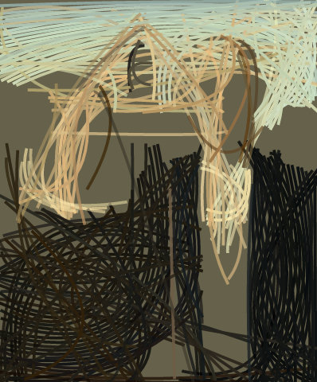
      </a>
       
      SVG 23.6 KB
    </td>
    <td align="center">
      
       
      SVG 121.2 KB
    </td>
  </tr>
  <tr>
    <td><strong>Rotated Ellipse</strong></td>
    <td align="center">
      <a href="images/progression/americangothic/rotated-ellipse-50.svg">
        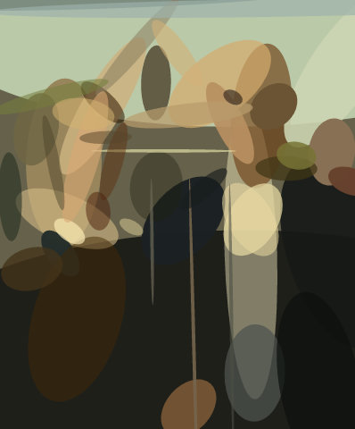
      </a>
       
      SVG 6.7 KB
    </td>
    <td align="center">
      
       
      SVG 26.6 KB
    </td>
    <td align="center">
      
       
      SVG 131.3 KB
    </td>
  </tr>
  <tr>
    <td><strong>Polygon</strong></td>
    <td align="center">
      
       
      SVG 4.8 KB
    </td>
    <td align="center">
      
       
      SVG 19.1 KB
    </td>
    <td align="center">
      
       
      SVG 96.2 KB
    </td>
  </tr>
</table>

### Downy Woodpecker

   
  Original · JPG 227.5 KB

<table>
  <tr>
    <th align="left">Shape mode</th>
    <th align="center">50 steps</th>
    <th align="center">200 steps</th>
    <th align="center">1000 steps</th>
  </tr>
  <tr>
    <td><strong>Mixed</strong></td>
    <td align="center">
      
       
      SVG 5.0 KB
    </td>
    <td align="center">
      
       
      SVG 21.4 KB
    </td>
    <td align="center">
      
       
      SVG 106.2 KB
    </td>
  </tr>
  <tr>
    <td><strong>Triangle</strong></td>
    <td align="center">
      
       
      SVG 4.4 KB
    </td>
    <td align="center">
      <a href="images/progression/downy-woodpecker/triangle-200.svg">
        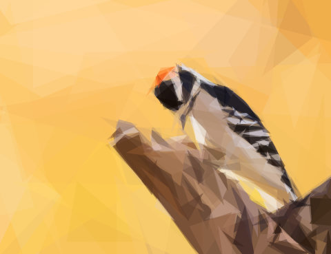
      </a>
       
      SVG 17.0 KB
    </td>
    <td align="center">
      
       
      SVG 84.5 KB
    </td>
  </tr>
  <tr>
    <td><strong>Rectangle</strong></td>
    <td align="center">
      
       
      SVG 4.2 KB
    </td>
    <td align="center">
      
       
      SVG 16.4 KB
    </td>
    <td align="center">
      
       
      SVG 79.7 KB
    </td>
  </tr>
  <tr>
    <td><strong>Ellipse</strong></td>
    <td align="center">
      
       
      SVG 4.1 KB
    </td>
    <td align="center">
      
       
      SVG 16.4 KB
    </td>
    <td align="center">
      
       
      SVG 80.6 KB
    </td>
  </tr>
  <tr>
    <td><strong>Circle</strong></td>
    <td align="center">
      
       
      SVG 3.7 KB
    </td>
    <td align="center">
      
       
      SVG 14.2 KB
    </td>
    <td align="center">
      
       
      SVG 70.3 KB
    </td>
  </tr>
  <tr>
    <td><strong>Rotated Rectangle</strong></td>
    <td align="center">
      
       
      SVG 5.7 KB
    </td>
    <td align="center">
      
       
      SVG 22.4 KB
    </td>
    <td align="center">
      
       
      SVG 111.0 KB
    </td>
  </tr>
  <tr>
    <td><strong>Quadratic</strong></td>
    <td align="center">
      <a href="images/progression/downy-woodpecker/quadratic-50.svg">
        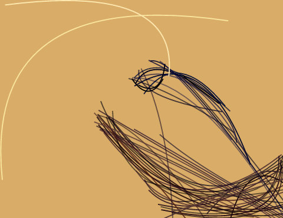
      </a>
       
      SVG 6.1 KB
    </td>
    <td align="center">
      <a href="images/progression/downy-woodpecker/quadratic-200.svg">
        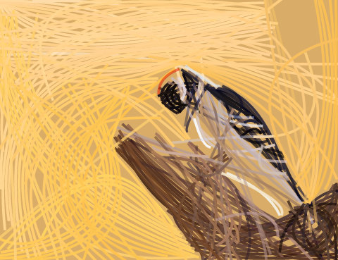
      </a>
       
      SVG 23.8 KB
    </td>
    <td align="center">
      <a href="images/progression/downy-woodpecker/quadratic-1000.svg">
        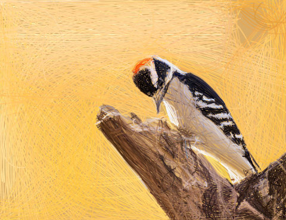
      </a>
       
      SVG 123.0 KB
    </td>
  </tr>
  <tr>
    <td><strong>Rotated Ellipse</strong></td>
    <td align="center">
      
       
      SVG 6.8 KB
    </td>
    <td align="center">
      
       
      SVG 26.9 KB
    </td>
    <td align="center">
      
       
      SVG 130.6 KB
    </td>
  </tr>
  <tr>
    <td><strong>Polygon</strong></td>
    <td align="center">
      
       
      SVG 5.0 KB
    </td>
    <td align="center">
      
       
      SVG 19.4 KB
    </td>
    <td align="center">
      
       
      SVG 97.0 KB
    </td>
  </tr>
</table>

### Grand Prismatic Spring

   
  Original · JPG 267.1 KB

<table>
  <tr>
    <th align="left">Shape mode</th>
    <th align="center">50 steps</th>
    <th align="center">200 steps</th>
    <th align="center">1000 steps</th>
  </tr>
  <tr>
    <td><strong>Mixed</strong></td>
    <td align="center">
      
       
      SVG 5.1 KB
    </td>
    <td align="center">
      
       
      SVG 20.1 KB
    </td>
    <td align="center">
      
       
      SVG 108.7 KB
    </td>
  </tr>
  <tr>
    <td><strong>Triangle</strong></td>
    <td align="center">
      
       
      SVG 4.4 KB
    </td>
    <td align="center">
      
       
      SVG 16.7 KB
    </td>
    <td align="center">
      
       
      SVG 84.1 KB
    </td>
  </tr>
  <tr>
    <td><strong>Rectangle</strong></td>
    <td align="center">
      <a href="images/progression/grand-prismatic-spring/rectangle-50.svg">
        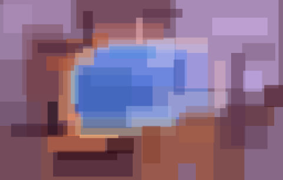
      </a>
       
      SVG 4.2 KB
    </td>
    <td align="center">
      
       
      SVG 16.4 KB
    </td>
    <td align="center">
      <a href="images/progression/grand-prismatic-spring/rectangle-1000.svg">
        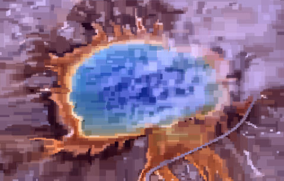
      </a>
       
      SVG 80.7 KB
    </td>
  </tr>
  <tr>
    <td><strong>Ellipse</strong></td>
    <td align="center">
      <a href="images/progression/grand-prismatic-spring/ellipse-50.svg">
        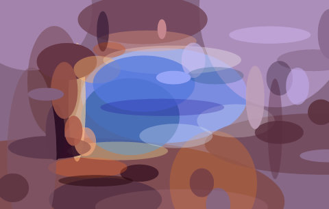
      </a>
       
      SVG 4.2 KB
    </td>
    <td align="center">
      
       
      SVG 16.5 KB
    </td>
    <td align="center">
      
       
      SVG 81.2 KB
    </td>
  </tr>
  <tr>
    <td><strong>Circle</strong></td>
    <td align="center">
      
       
      SVG 3.7 KB
    </td>
    <td align="center">
      
       
      SVG 14.5 KB
    </td>
    <td align="center">
      
       
      SVG 70.8 KB
    </td>
  </tr>
  <tr>
    <td><strong>Rotated Rectangle</strong></td>
    <td align="center">
      
       
      SVG 5.6 KB
    </td>
    <td align="center">
      
       
      SVG 21.6 KB
    </td>
    <td align="center">
      <a href="images/progression/grand-prismatic-spring/rotated-rectangle-1000.svg">
        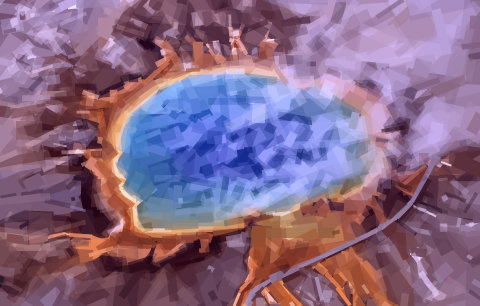
      </a>
       
      SVG 108.5 KB
    </td>
  </tr>
  <tr>
    <td><strong>Quadratic</strong></td>
    <td align="center">
      <a href="images/progression/grand-prismatic-spring/quadratic-50.svg">
        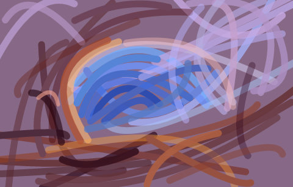
      </a>
       
      SVG 6.2 KB
    </td>
    <td align="center">
      <a href="images/progression/grand-prismatic-spring/quadratic-200.svg">
        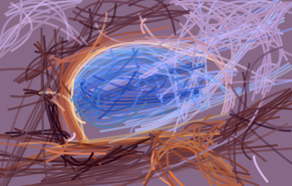
      </a>
       
      SVG 24.5 KB
    </td>
    <td align="center">
      
       
      SVG 123.0 KB
    </td>
  </tr>
  <tr>
    <td><strong>Rotated Ellipse</strong></td>
    <td align="center">
      
       
      SVG 6.8 KB
    </td>
    <td align="center">
      
       
      SVG 26.6 KB
    </td>
    <td align="center">
      <a href="images/progression/grand-prismatic-spring/rotated-ellipse-1000.svg">
        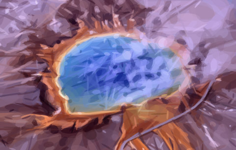
      </a>
       
      SVG 131.0 KB
    </td>
  </tr>
  <tr>
    <td><strong>Polygon</strong></td>
    <td align="center">
      
       
      SVG 4.9 KB
    </td>
    <td align="center">
      
       
      SVG 19.2 KB
    </td>
    <td align="center">
      
       
      SVG 95.7 KB
    </td>
  </tr>
</table>

### Mae Jemison

   
  Original · JPG 207.3 KB

<table>
  <tr>
    <th align="left">Shape mode</th>
    <th align="center">50 steps</th>
    <th align="center">200 steps</th>
    <th align="center">1000 steps</th>
  </tr>
  <tr>
    <td><strong>Mixed</strong></td>
    <td align="center">
      
       
      SVG 5.1 KB
    </td>
    <td align="center">
      
       
      SVG 20.7 KB
    </td>
    <td align="center">
      
       
      SVG 107.5 KB
    </td>
  </tr>
  <tr>
    <td><strong>Triangle</strong></td>
    <td align="center">
      
       
      SVG 4.3 KB
    </td>
    <td align="center">
      
       
      SVG 16.9 KB
    </td>
    <td align="center">
      
       
      SVG 84.5 KB
    </td>
  </tr>
  <tr>
    <td><strong>Rectangle</strong></td>
    <td align="center">
      <a href="images/progression/mae-jemison/rectangle-50.svg">
        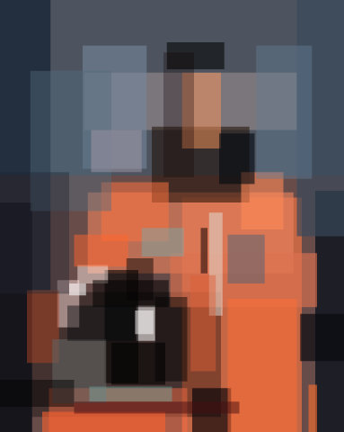
      </a>
       
      SVG 4.2 KB
    </td>
    <td align="center">
      
       
      SVG 16.4 KB
    </td>
    <td align="center">
      
       
      SVG 79.5 KB
    </td>
  </tr>
  <tr>
    <td><strong>Ellipse</strong></td>
    <td align="center">
      
       
      SVG 4.2 KB
    </td>
    <td align="center">
      
       
      SVG 16.5 KB
    </td>
    <td align="center">
      
       
      SVG 80.9 KB
    </td>
  </tr>
  <tr>
    <td><strong>Circle</strong></td>
    <td align="center">
      
       
      SVG 3.6 KB
    </td>
    <td align="center">
      
       
      SVG 14.2 KB
    </td>
    <td align="center">
      
       
      SVG 70.4 KB
    </td>
  </tr>
  <tr>
    <td><strong>Rotated Rectangle</strong></td>
    <td align="center">
      
       
      SVG 5.6 KB
    </td>
    <td align="center">
      
       
      SVG 22.0 KB
    </td>
    <td align="center">
      
       
      SVG 110.0 KB
    </td>
  </tr>
  <tr>
    <td><strong>Quadratic</strong></td>
    <td align="center">
      <a href="images/progression/mae-jemison/quadratic-50.svg">
        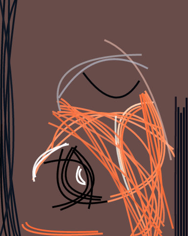
      </a>
       
      SVG 5.9 KB
    </td>
    <td align="center">
      <a href="images/progression/mae-jemison/quadratic-200.svg">
        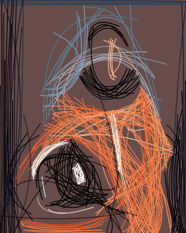
      </a>
       
      SVG 23.9 KB
    </td>
    <td align="center">
      
       
      SVG 121.5 KB
    </td>
  </tr>
  <tr>
    <td><strong>Rotated Ellipse</strong></td>
    <td align="center">
      
       
      SVG 6.9 KB
    </td>
    <td align="center">
      
       
      SVG 26.8 KB
    </td>
    <td align="center">
      
       
      SVG 131.1 KB
    </td>
  </tr>
  <tr>
    <td><strong>Polygon</strong></td>
    <td align="center">
      
       
      SVG 4.8 KB
    </td>
    <td align="center">
      
       
      SVG 19.4 KB
    </td>
    <td align="center">
      
       
      SVG 96.6 KB
    </td>
  </tr>
</table>

### Mona Lisa

   
  Original · JPG 149.5 KB

<table>
  <tr>
    <th align="left">Shape mode</th>
    <th align="center">50 steps</th>
    <th align="center">200 steps</th>
    <th align="center">1000 steps</th>
  </tr>
  <tr>
    <td><strong>Mixed</strong></td>
    <td align="center">
      
       
      SVG 5.0 KB
    </td>
    <td align="center">
      
       
      SVG 20.4 KB
    </td>
    <td align="center">
      
       
      SVG 107.4 KB
    </td>
  </tr>
  <tr>
    <td><strong>Triangle</strong></td>
    <td align="center">
      
       
      SVG 4.4 KB
    </td>
    <td align="center">
      
       
      SVG 17.1 KB
    </td>
    <td align="center">
      
       
      SVG 83.7 KB
    </td>
  </tr>
  <tr>
    <td><strong>Rectangle</strong></td>
    <td align="center">
      <a href="images/progression/monalisa/rectangle-50.svg">
        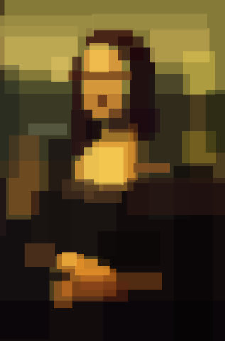
      </a>
       
      SVG 4.2 KB
    </td>
    <td align="center">
      
       
      SVG 16.5 KB
    </td>
    <td align="center">
      
       
      SVG 81.2 KB
    </td>
  </tr>
  <tr>
    <td><strong>Ellipse</strong></td>
    <td align="center">
      
       
      SVG 4.3 KB
    </td>
    <td align="center">
      
       
      SVG 16.8 KB
    </td>
    <td align="center">
      
       
      SVG 82.2 KB
    </td>
  </tr>
  <tr>
    <td><strong>Circle</strong></td>
    <td align="center">
      
       
      SVG 3.7 KB
    </td>
    <td align="center">
      
       
      SVG 14.5 KB
    </td>
    <td align="center">
      
       
      SVG 71.5 KB
    </td>
  </tr>
  <tr>
    <td><strong>Rotated Rectangle</strong></td>
    <td align="center">
      
       
      SVG 5.6 KB
    </td>
    <td align="center">
      
       
      SVG 22.2 KB
    </td>
    <td align="center">
      
       
      SVG 109.0 KB
    </td>
  </tr>
  <tr>
    <td><strong>Quadratic</strong></td>
    <td align="center">
      <a href="images/progression/monalisa/quadratic-50.svg">
        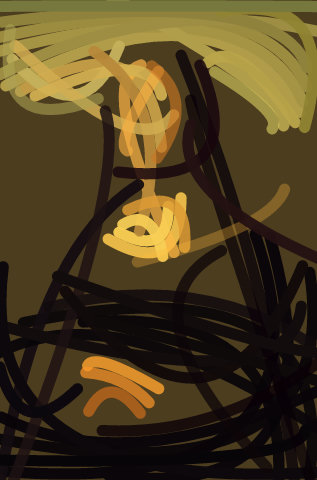
      </a>
       
      SVG 5.9 KB
    </td>
    <td align="center">
      <a href="images/progression/monalisa/quadratic-200.svg">
        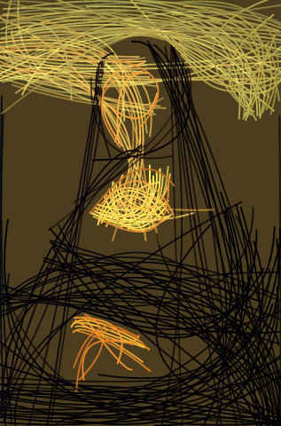
      </a>
       
      SVG 23.8 KB
    </td>
    <td align="center">
      
       
      SVG 122.1 KB
    </td>
  </tr>
  <tr>
    <td><strong>Rotated Ellipse</strong></td>
    <td align="center">
      
       
      SVG 6.8 KB
    </td>
    <td align="center">
      
       
      SVG 26.6 KB
    </td>
    <td align="center">
      <a href="images/progression/monalisa/rotated-ellipse-1000.svg">
        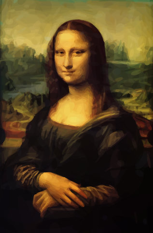
      </a>
       
      SVG 131.2 KB
    </td>
  </tr>
  <tr>
    <td><strong>Polygon</strong></td>
    <td align="center">
      
       
      SVG 4.9 KB
    </td>
    <td align="center">
      <a href="images/progression/monalisa/polygon-200.svg">
        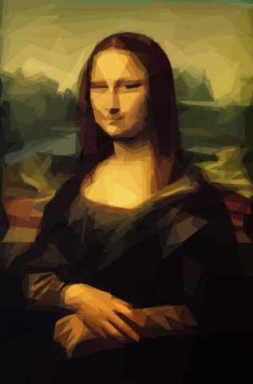
      </a>
       
      SVG 19.1 KB
    </td>
    <td align="center">
      
       
      SVG 95.7 KB
    </td>
  </tr>
</table>

<!-- markdownlint-enable MD033 -->
